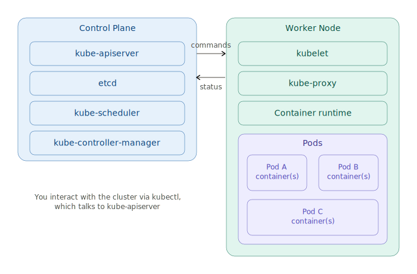

# Kubernetes Architecture

A structured, from-scratch guide to Kubernetes architecture — what each component does, why it exists, and how they all fit together.

---

## 📋 Table of Contents

1. [What is Kubernetes](#1-what-is-kubernetes)
2. [Why Kubernetes (the problem it solves)](#2-why-kubernetes-the-problem-it-solves)
3. [Cluster Architecture Overview](#3-cluster-architecture-overview)
4. [Control Plane Components](#4-control-plane-components)
5. [Worker Node Components](#5-worker-node-components)
6. [What is a Pod](#6-what-is-a-pod)
7. [Putting It All Together — Request Flow](#7-putting-it-all-together--request-flow)

---

## 1. What is Kubernetes

Kubernetes (K8s) is a **container orchestration platform** — it manages, schedules, scales, and heals containers across many machines automatically, so you don't have to manually run `docker run` on ten servers and babysit them.

> **Docker runs one container. Kubernetes runs and manages thousands, across many machines, automatically.**

**In one line:** you tell Kubernetes *what* you want ("run 3 copies of this app, always keep 3 running"), and Kubernetes constantly works to make that true — even if a server crashes, a container dies, or traffic spikes.

---

## 2. Why Kubernetes (the problem it solves)

Once you have many containers across many servers, new problems appear that plain Docker doesn't solve:

- **Which server should this container run on?** (scheduling)
- **What happens if a container crashes?** (self-healing)
- **How do containers find each other across servers?** (service discovery)
- **How do I scale to 10 copies during high traffic, then back to 2?** (scaling)
- **How do I roll out a new version without downtime?** (rolling updates)
- **How do I store secrets/config safely across many containers?** (config/secrets management)

Kubernetes' entire architecture exists to answer these exact questions.

---

## 3. Cluster Architecture Overview

A Kubernetes **cluster** has two types of machines:

| Part | Role |
|---|---|
| **Control Plane** | The "brain" — makes all the decisions (scheduling, scaling, healing), but doesn't run your app containers itself |
| **Worker Node(s)** | The "hands" — actually run your application containers, inside Pods |

You (the user) talk to the cluster using the `kubectl` CLI, which sends requests to the control plane's API server — you never talk to worker nodes directly.

---

## 4. Control Plane Components

The control plane is usually one or more dedicated machines running these processes:

### `kube-apiserver`
The **front door** to the entire cluster. Every single action — `kubectl get pods`, a scheduler decision, a kubelet status update — goes through the API server. It's the only component that talks directly to `etcd`.

> Think of it as the reception desk of a company: every request, from anyone, goes through it first.

### `etcd`
A distributed, consistent **key-value store** — this is the cluster's entire memory. Every object (Pods, Deployments, Services, ConfigMaps) is stored here as data.

> If `etcd` is lost with no backup, your cluster effectively "forgets" everything it knows about itself.

### `kube-scheduler`
Watches for newly created Pods that don't yet have a node assigned, and decides **which worker node** they should run on — based on available CPU/memory, affinity rules, taints/tolerations, etc.

> Like an office manager assigning a new employee to whichever desk/floor has room and matches their needs.

### `kube-controller-manager`
Runs many small **control loops** that constantly compare "what you want" (desired state) vs. "what's actually happening" (current state), and fixes any difference. Examples:
- Node controller — notices when a node goes offline
- Replication controller — makes sure the right number of Pod copies are running
- Endpoints controller — keeps Service-to-Pod mappings up to date

> This is the self-healing engine — always watching and correcting.

---

## 5. Worker Node Components

Every worker node runs these processes:

### `kubelet`
An agent running on **every** node. It talks to the API server, receives instructions ("run this Pod here"), and makes sure the containers described in that Pod are actually running and healthy on this machine.

> The kubelet is like a site supervisor — it doesn't decide what to build, but makes sure what was assigned to its site actually gets built and stays standing.

### `kube-proxy`
Handles **networking** on each node — maintains network rules so traffic can reach the right Pods, even as Pods are created, destroyed, or moved around. This is what makes Kubernetes Services work.

### Container Runtime
The actual engine that runs containers on that node (e.g. `containerd`, `CRI-O`). Kubernetes talks to it through a standard interface called the **CRI (Container Runtime Interface)** — this is exactly the same `containerd` layer we covered in Docker fundamentals.

---

## 6. What is a Pod

A **Pod** is the smallest deployable unit in Kubernetes — **not** a container itself, but a wrapper around one or more containers that:
- Share the same network namespace (same IP address, can talk via `localhost`)
- Share the same storage volumes
- Are always scheduled together, on the same node

> **Analogy:** if a container is a single tenant, a Pod is the apartment unit — usually holds one tenant, but can hold a couple of tightly-coupled roommates (e.g. a main app container + a logging sidecar container) who need to share the same space.

Most Pods run a **single container** — multi-container Pods are the exception, used for tightly coupled helper processes (sidecars).

Pods are **ephemeral** — they can be destroyed and recreated at any time (a new Pod gets a new IP). You almost never create raw Pods directly in real use; instead you use a **Deployment**, which manages Pods for you (covered in the next topic).

---

## 7. Putting It All Together — Request Flow

When you run `kubectl apply -f my-deployment.yaml`:

1. `kubectl` sends the request to **kube-apiserver**
2. **kube-apiserver** validates it and stores the desired state in **etcd**
3. **kube-controller-manager** notices new Pods are needed and creates Pod objects
4. **kube-scheduler** sees unscheduled Pods and assigns each one to a suitable node
5. **kubelet** on that node sees the assignment and tells the **container runtime** to actually start the container(s)
6. **kube-proxy** updates networking rules so traffic can reach the new Pod
7. The control loop in **kube-controller-manager** keeps watching forever — if the Pod dies, it creates a replacement automatically

This loop — watch, compare, correct — running constantly, is the core idea behind everything Kubernetes does.

---

