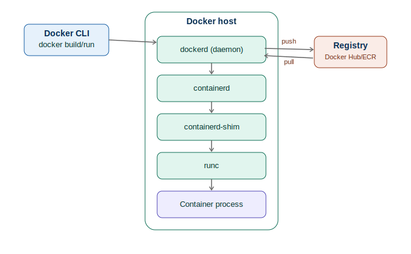
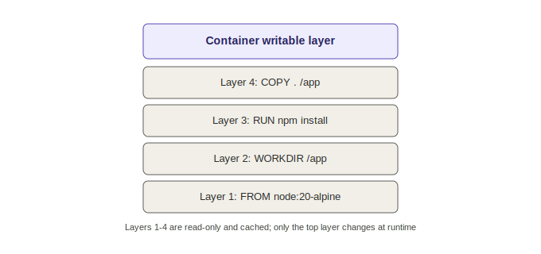
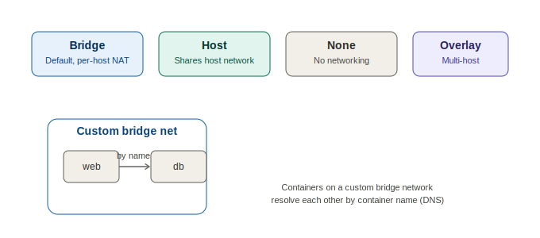

# Docker Fundamentals

A structured, hands-on Docker fundamentals guide → Kubernetes (CKA) learning journey.

---

## 📋 Table of Contents

1. [What is Docker](#1-what-is-docker)
2. [Containers vs Virtual Machines](#2-containers-vs-virtual-machines)
3. [Docker Architecture](#3-docker-architecture)
4. [Namespaces & cgroups](#4-namespaces--cgroups)
5. [Images & Layers](#5-images--layers)
6. [Dockerfile Instructions](#6-dockerfile-instructions)
7. [Container Lifecycle & Core Commands](#7-container-lifecycle--core-commands)
8. [Networking](#8-networking)
9. [Storage & Volumes](#9-storage--volumes)
10. [Docker Compose](#10-docker-compose)
11. [Registries & Security](#11-registries--security)
12. [Resource Limits & Health Checks](#12-resource-limits--health-checks)

---

## 1. What is Docker

Docker is a platform that packages an application with everything it needs — code, runtime, libraries, config — into a single portable unit called a **container**, using OS-level virtualization.

> **Docker = build once, run anywhere, exactly the same way.**

**Key terms:**
- **Image** — a read-only template/blueprint
- **Container** — a running instance of an image, with its own writable layer
- **Dockerfile** — a text recipe describing how to build an image
- **Registry** — remote storage for images (Docker Hub, ECR, GCR, Artifact Registry)

---

## 2. Containers vs Virtual Machines

| | Virtual Machine | Container |
|---|---|---|
| **What it virtualizes** | Entire hardware | The OS (processes only) |
| **OS per instance** | Own full guest OS | Shares host's kernel |
| **Boot time** | Minutes | Milliseconds |
| **Size** | Several GBs | Usually MBs |
| **Isolation** | Very strong (separate kernel) | Process-level (namespaces + cgroups) |

**Analogy:** VMs are separate houses, each built from the ground up with its own foundation. Containers are apartments in one building — separately walled off, but sharing one foundation (the host kernel), so adding a new one is fast.

---

## 3. Docker Architecture



Docker follows a **client-server model**:

| Component | Role |
|---|---|
| **Docker CLI** | Sends your command as a REST API request to the daemon |
| **dockerd** | Background service that does the actual work — builds, networks, volumes |
| **containerd** | Manages container lifecycle; what Kubernetes talks to directly |
| **containerd-shim** | One per running container, keeps it alive even if dockerd/containerd restart |
| **runc** | Creates the isolated Linux process using namespaces + cgroups, then exits |
| **Registry** | Remote image storage — `docker push` uploads, `docker pull` downloads |

---

## 4. Namespaces & cgroups

- **Namespaces** — isolate *what a container can see*: PID, NET, MNT, UTS, IPC, USER
- **cgroups** — limit *what a container can use*: CPU, memory, disk I/O, network bandwidth

No namespace/cgroup = no real isolation. This is the Linux kernel machinery Docker wraps in a friendly CLI.

---

## 5. Images & Layers



An image is a stack of read-only layers — one per Dockerfile instruction that changes the filesystem. A container adds one thin writable layer on top.

**Why layer order matters (build cache):** put things that change rarely (base image, dependencies) *before* things that change often (app source):

```dockerfile
FROM node:20-alpine        # changes rarely
WORKDIR /app
COPY package*.json ./      # changes occasionally
RUN npm install             # cached if package.json unchanged
COPY . .                    # changes every commit — put last
CMD ["node", "index.js"]
```

---

## 6. Dockerfile Instructions

| Instruction | Purpose |
|---|---|
| `FROM` | Base image |
| `WORKDIR` | Working directory inside image |
| `COPY` / `ADD` | Copy files into image (`ADD` also handles URLs/tar extraction) |
| `RUN` | Executes command at build time, creates a new layer |
| `CMD` | Default command when container starts (overridable) |
| `ENTRYPOINT` | Fixed command that always runs; `CMD` becomes its default args |
| `ENV` | Environment variable, available at build + runtime |
| `ARG` | Build-time-only variable |
| `EXPOSE` | Documents the port the app listens on (doesn't publish it) |
| `USER` | Runs as non-root user |
| `VOLUME` | Marks a path as an external mount point |
| `HEALTHCHECK` | Command Docker runs periodically to check health |

**Multi-stage build** (smaller final image):
```dockerfile
FROM node:20 AS builder
WORKDIR /app
COPY . .
RUN npm install && npm run build

FROM node:20-alpine
WORKDIR /app
COPY --from=builder /app/dist ./dist
CMD ["node", "dist/index.js"]
```

---

## 7. Container Lifecycle & Core Commands

States: `created → running → paused → stopped (exited) → removed`

```bash
docker build -t myapp:1.0 .
docker run -d -p 8080:80 --name web myapp:1.0
docker ps
docker ps -a
docker logs -f web
docker exec -it web sh
docker stop web
docker start web
docker rm web
docker images
docker rmi myapp:1.0
docker inspect web
docker system prune -a
```

---

## 8. Networking



| Driver | Description |
|---|---|
| **bridge** (default) | Private internal network on the host, NAT'd IPs |
| **host** | Container shares host's network stack directly |
| **none** | No networking at all |
| **overlay** | Spans multiple Docker hosts |
| **macvlan** | Container gets its own MAC address on the LAN |

**Port mapping vs EXPOSE:** `EXPOSE 3000` is documentation only. `docker run -p 8080:3000` actually publishes the port.

```bash
docker network create mynet
docker run -d --network mynet --name db postgres
docker run -d --network mynet --name web myapp   # resolves "db" via Docker DNS
```

---

## 9. Storage & Volumes

Containers are ephemeral — data in the writable layer is lost when removed.

| Type | Where it lives | Use case |
|---|---|---|
| **Named volume** | Managed by Docker | Persistent app data (DBs) |
| **Bind mount** | Anywhere on host filesystem | Local dev, live source mounting |
| **tmpfs mount** | Host memory only | Sensitive/temp data |

```bash
docker volume create dbdata
docker run -d -v dbdata:/var/lib/postgresql/data postgres
docker run -d -v $(pwd)/src:/app/src myapp
docker run -d --tmpfs /app/cache myapp
```

---

## 10. Docker Compose

```yaml
version: "3.9"
services:
  web:
    build: .
    ports:
      - "8080:3000"
    depends_on:
      - db
    environment:
      - DB_HOST=db
  db:
    image: postgres:16
    volumes:
      - dbdata:/var/lib/postgresql/data
    environment:
      - POSTGRES_PASSWORD=secret
volumes:
  dbdata:
```

---

## 11. Registries & Security

- **Registries**: Docker Hub, AWS ECR, GCP Artifact Registry, private self-hosted registries
- **Tagging & pushing**: `docker tag myapp:1.0 myregistry/myapp:1.0` → `docker push myregistry/myapp:1.0`
- **Non-root containers**: add `USER appuser` — running as root is a common security gap
- **Secrets**: never bake into image layers — use env vars at runtime or a secrets manager
- **Scanning**: Trivy or `docker scout` scan images for known CVEs

---

## 12. Resource Limits & Health Checks

```bash
docker run -d --memory=512m --cpus=0.5 myapp
```
```dockerfile
HEALTHCHECK --interval=30s --timeout=5s CMD curl -f http://localhost:3000/health || exit 1
```

These map almost 1:1 to Kubernetes `resources.limits` and liveness/readiness probes.

---

## 🛠 Practice

For hands-on practice building and running these concepts, see [`getting-started-app/`](../getting-started-app/README.md) — a simple app to build an image and run it as a container.
